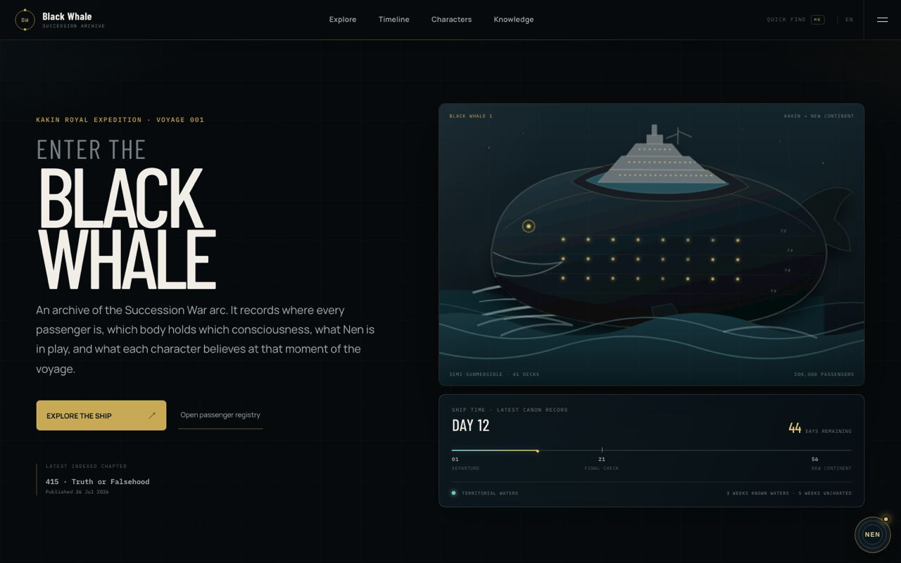
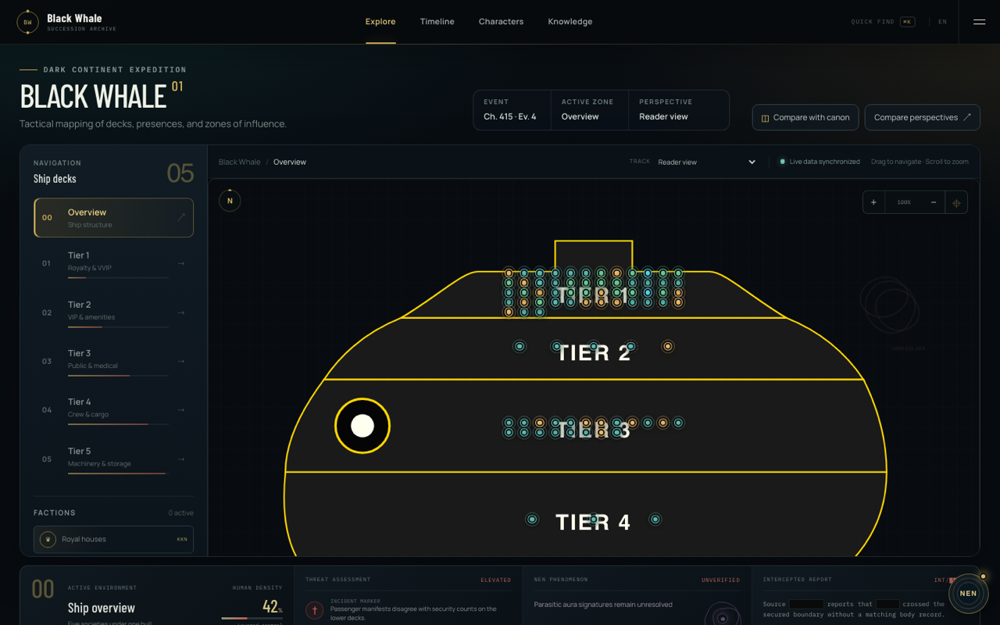
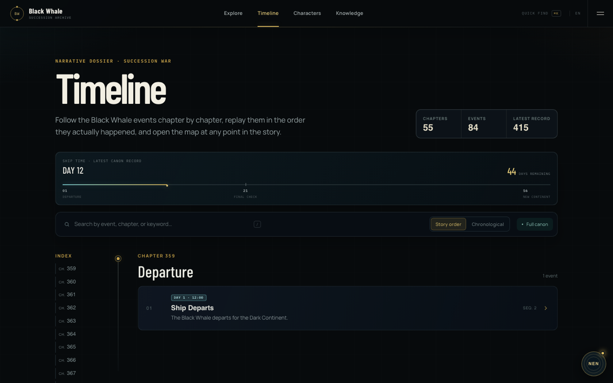
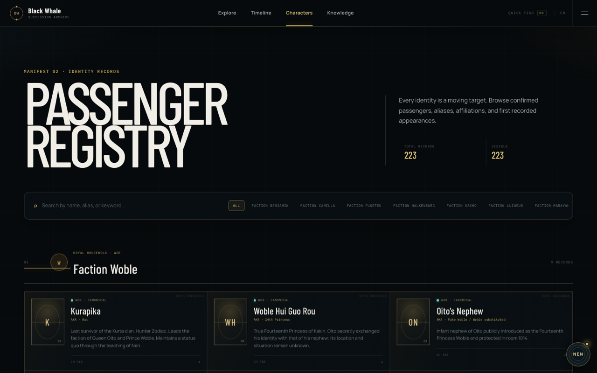
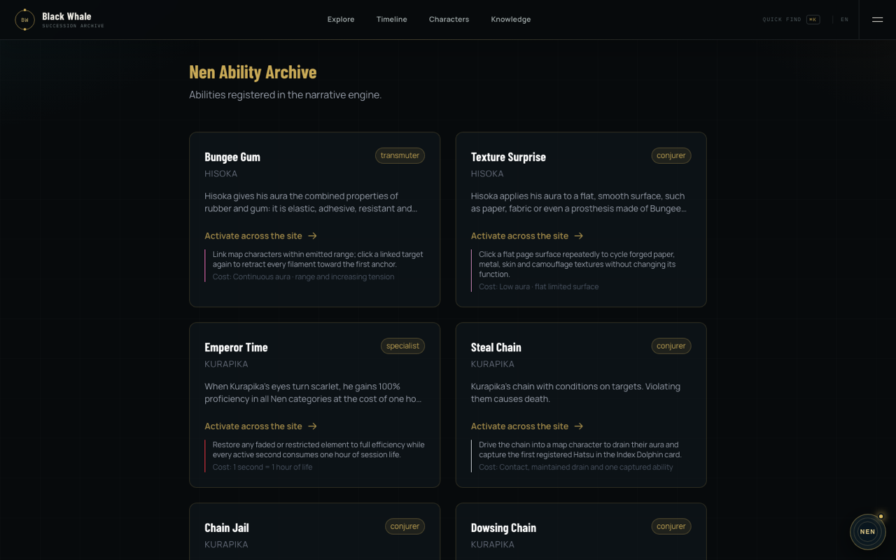

# Black Whale

**An interactive archive of the Hunter × Hunter Succession War — where every record belongs to a time, a source, and a point of view.**

[**exploreblackwhale.com**](https://exploreblackwhale.com) · [Ship map](https://exploreblackwhale.com/ship) · [Virtual tour](https://exploreblackwhale.com/tour) · [Timeline](https://exploreblackwhale.com/timeline) · [Passenger registry](https://exploreblackwhale.com/characters) · [Nen abilities](https://exploreblackwhale.com/abilities)

[](https://github.com/PISSARAW/Black-Whale/actions/workflows/ci.yml)


[](https://exploreblackwhale.com)

---

## Why this exists

The Succession War is the hardest arc in Hunter × Hunter to hold in your head. Fourteen princes, a dozen factions and a Nen war are running at once inside one ship, and the story is deliberately built on incomplete information: consciousnesses move between bodies, guards report to two masters at once, and half the cast is acting on facts that stopped being true three chapters ago.

Most wikis flatten that into a single omniscient present tense. This archive refuses to. Every record it holds is attached to a moment in the voyage, a source, and an observer — so you can ask not just _what happened_, but _who knew it, when, and what they believed instead_.

A canonical event identifies a `StoryCursor`; a pure reducer replays typed events into a `WorldState`; the map, the timeline and each character's perspective are projections of that same state. Nothing is stored twice.

---

## What you can do with it

### Walk the ship, deck by deck

Five tiers, 37 hand-drawn SVG deck and room maps, and every tracked body placed on them at the event you select. Move the cursor along the story and the ship repopulates.

[](https://exploreblackwhale.com/ship)

### Walk it in first person

[`/tour`](https://exploreblackwhale.com/tour) is the same ship as geometry rather than as a drawing: five decks, 314 reconstructed spaces, and a first-person walk through all of them. It carries no passengers and no chapter — it answers _how the ship is built_, where the map answers _who is where_.

The deck plans are schematic and the room plans are not, so the tour keeps both rather than distorting either: a deck shows the footprint its plan draws, and a room with an interior of its own — each prince's apartment, the detention block, the Justice Bureau, the hospital, the King's living room, the burial chamber, the courthouse, the Heil-Ly hideout, a lifeboat, thirty-five in all — is entered through its door and walked at full size.

The tour does not decorate — it never invents where a chair stood — but it draws what a drawing puts there, and what a panel makes the room. The prince apartment plan gives each suite its beds, sofas, dining table and kitchen; ch. 371 rings the burial chamber with fourteen coffins; ch. 383 gives the banquet hall its stage and the throne on its dais, and the launch bays their pods; ch. 406 the springs the hull holds the ship on. Each carries its own source, and each is solid, so you walk around it.

Every surface declares what it is worth as evidence. A room a panel shows is lit warm, a room that only appears on the deck cross-section is left plain, and a corridor the reconstruction had to invent to make the deck contiguous is lit cold and badged as such. Doorways are not authored: two rooms that share a stretch of wall open onto each other, so an unreachable room fails the test suite rather than the visit.

What no plan can draw is derived rather than invented, and each derivation is local, small and stated. A seven-thousand-square-metre hall with nothing holding its roof up is a false claim about the ship, so pillars go up on an 11 m grid clear of the walls. A deck is steel plate, so seams run a 1.2 m course laid in the ship's coordinates and carry on through a doorway instead of restarting at every threshold. A partition of no thickness is a claim too, so each of the 368 openings gets a 30 cm frame of cheeks and soffit — thickness is claimed at the one place it can be seen, and nowhere else. The frame is in the same list collision reads, so what stops you is what is drawn.

The ship also models what it already measures: light, air, sound and a pace. Fittings hang on an 8 m ceiling grid and their light is baked into every vertex, so each room is lit by the lamps you can look up at and by nothing else — there is no ambient light aboard a ship and none in the walk, so a corridor with no fitting in view is black rather than dark grey. The ten rooms with both the height and the floor for it — the banquet hall, the screening room, the observation deck, the Cha-R hold, the spring bay among them — hold dust, because a five-thousand-square-metre room with nothing in the middle of it cannot otherwise be felt as large. The haze is scaled to the longest sight line a room offers, rather than one fog setting standing in for both a twelve-square-metre cabin and a five-and-a-half-thousand-square-metre hold. And the walk is audible: footsteps synthesised rather than sampled, run through a convolution reverberation whose impulse response is computed from the room's own volume by Sabine's equation — a cabin and the hold differ by about a factor of six in reverberation time, which the ear reads in a single step. Under all of it is the hull: a 38 Hz engine note and a bed of pink noise, filtered by how much steel stands between the deck you are on and the machinery — full and open in the hold, an eighth of that and dull seventy-two metres up in the King's rooms, so descending a stairwell is something you hear. None of it adds an asset to the page or a field to the blueprint. The pace is the same kind of fact: you walk at 2.1 m/s because that is what the scale of the reconstruction makes a walk, and the length of the banquet hall is something you spend time on rather than something the minimap asserts.

The blueprint's hardest fact is that of 314 spaces, exactly two can see out: the observation deck (ch. 380) and the far end of the King's living room (ch. 382). Both are declared as windows rather than derived, both are drawn as cold light against the filament warmth of every other source on board, and both are sources in the bake — so the two rooms on the ship where the outside exists are the two rooms you can feel it in. The other 312 are lit by what someone switched on.

The reconstruction dossier — the scale factor, the order of authority (manga → `/ship` → tour) and what each derived detail is allowed to assert — is [`data/ship/README.md`](data/ship/README.md).

### Replay the voyage event by event

Every confrontation, alliance and consciousness transfer in story order or in chronological order — the two disagree, and the arc depends on it. A spoiler filter caps the archive at the last chapter you have read.

[](https://exploreblackwhale.com/timeline)

### Look up any of the 223 passengers

Princes, guards, mafia families, Hunters and the Phantom Troupe, grouped by faction, with aliases, affiliations and first recorded appearance.

[](https://exploreblackwhale.com/characters)

### Trace who is working with — or against — whom

[`/relationships`](https://exploreblackwhale.com/relationships) draws the alliances, rivalries, patronages and proxy wars between princes, mafia families and Hunter factions. Every edge carries the chapter it was established in and the passage that evidences it, and the spoiler filter hides the ones you have not reached yet.

### Read the Nen

83 abilities across 54 users, each with its category, conditions and cost — and each one executable against the archive itself, so you can watch an ability change what the site shows you.

[](https://exploreblackwhale.com/abilities)

### See the world through one mind

[`/perspectives/:character`](https://exploreblackwhale.com/perspectives) rebuilds the ship as a single character understands it: confirmed positions, likely positions, last-known positions, and beliefs that have quietly gone stale. [`/compare`](https://exploreblackwhale.com/compare) puts two of them side by side and marks where they disagree.

### Fork the canon

[`/simulations`](https://exploreblackwhale.com/simulations) branches the timeline at any event, runs typed actions against the branch, and projects the outcome on the same map — without touching the canonical record.

---

## The five questions the engine answers

At any point in the story:

1. **What is actually happening on the Black Whale?** → world state at a `StoryCursor`
2. **Where is each body?** → map presence projection
3. **Which consciousness is in which body?** → identity engine
4. **What does each character know or believe?** → perspective + knowledge engines
5. **How does a Nen ability change reality, or only the perception of it?** → nen engine

All five resolve through the same temporal model. Nen abilities emit the same typed events as canon, and the map consumes a `MapScene` projection rather than reimplementing domain rules in Svelte.

---

## Architecture

```
black-whale/
├── apps/
│   ├── web/       # Public SvelteKit app (port 3000)
│   └── admin/     # Back-office SvelteKit app (port 3002)
│
├── packages/
│   ├── domain/              # Shared TypeScript models & domain events
│   ├── database/            # Prisma schema and PostgreSQL client
│   ├── world-engine/        # Pure event reducer, invariants, cursors & projections
│   ├── timeline-engine/     # Reconstructs world state at any event
│   ├── identity-engine/     # Separates body / consciousness / aura
│   ├── perspective-engine/  # Filters world through a character's POV
│   ├── knowledge-engine/    # What each character knows or believes
│   ├── spoiler-engine/      # Protects users from future chapter spoilers
│   ├── nen-engine/          # Validates and executes Nen abilities
│   ├── simulation-engine/   # Non-canonical branch timelines
│   ├── map-engine/          # Ship map layers and entity positions
│   ├── ability-sdk/         # DSL for defining Nen ability modules
│   └── ability-modules/     # Concrete ability implementations
│
├── data/                    # The catalogue: chapters, characters, abilities, locations,
│                            # plus ship/blueprint.json, the metric reconstruction
└── infrastructure/
    ├── docker/              # Development and production Docker stacks
    └── hetzner/             # Deploy, backup, restore, and operations runbook
```

| Layer         | Tech                                      |
| ------------- | ----------------------------------------- |
| Frontend      | SvelteKit 5, Tailwind CSS, TanStack Query |
| Server        | SvelteKit load functions and form actions |
| Database      | PostgreSQL 16                             |
| ORM           | Prisma                                    |
| Reverse proxy | Caddy with automatic HTTPS                |
| Deployment    | Docker Compose on Hetzner Cloud           |
| Monorepo      | pnpm workspaces + Turborepo               |

---

## Run it locally

**Prerequisites:** Node ≥ 20, pnpm ≥ 9, and a PostgreSQL 16 instance.

```bash
pnpm install
createdb blackwhale

# Set DATABASE_URL in apps/web, apps/admin and packages/database
# postgresql://<user>@localhost:5432/blackwhale?schema=public
pnpm --filter "@black-whale/database" db:push

pnpm dev            # every app in parallel, web on :3000
```

Or bring up the whole stack in Docker:

```bash
docker compose -f infrastructure/docker/docker-compose.yml up --build
```

`packages/database/prisma/schema.prisma` is the single source of truth for the schema, and `packages/database/prisma/migrations` its only migration history. Development uses `prisma db push`; production applies the versioned baseline through `prisma migrate deploy`. Never run `db push` against production.

Other commands: `pnpm build`, `pnpm typecheck`, `pnpm test`, `pnpm lint`, `pnpm format`.

---

## Deploy it

The production topology exposes only ports 80 and 443 through Caddy. Web, admin and PostgreSQL stay on a private Docker network, and the admin panel requires an authenticated, signed, HTTP-only session.

```bash
cp .env.production.example .env.production
chmod 600 .env.production          # generate every secret independently
./infrastructure/hetzner/deploy.sh
```

The script validates the Compose configuration, builds immutable images, applies Prisma migrations, waits for healthchecks, then exposes the stack. Caddy obtains and renews TLS certificates on its own. PostgreSQL is dumped every 24 hours with 14-day retention.

| Service            | URL                                   |
| ------------------ | ------------------------------------- |
| Public application | `https://<domain>`                    |
| Administration     | `https://admin.<domain>`              |
| Health endpoints   | `/health` on each application service |

The full [Hetzner runbook](infrastructure/hetzner/README.md) covers server sizing, firewall rules, DNS, upgrades, logs, backup and restoration.

---

## Roadmap

| Version | Scope                                                                                      | Status                                                     |
| ------- | ------------------------------------------------------------------------------------------ | ---------------------------------------------------------- |
| **v1**  | Ship map, characters, positions, timeline, spoiler filter                                  | ✅ Released                                                |
| **v2**  | Body/consciousness split, knowledge engine, perspective comparison                         | ✅ Foundation shipped                                      |
| **v3**  | Nen action plans, explainable conditions, typed effects                                    | ✅ Shipped — surfaced in `/simulations`                    |
| **v4**  | Ability modules migrated to the shared runtime                                             | ✅ All 83 catalogue abilities have a module                |
| **v5**  | Persistent branches and map projections                                                    | 🏗️ First vertical shipped                                  |
| **v6**  | Metric reconstruction of the ship, a first-person walk, and the light, air and sound of it | ✅ Shipped — [`/tour`](https://exploreblackwhale.com/tour) |

A v3 plan is built by the ability module itself: its conditions are predicates over the world state, and its projected effects are obtained by running its own effect builders. The archive therefore cannot describe an ability doing one thing and execute another — [`/simulations`](https://exploreblackwhale.com/simulations) shows the plan before you run it.

---

## Contributing

The catalogue under `data/` is the easiest place to start: it is plain JSON, and the conventions are documented in [`data/CONVENTIONS.md`](data/CONVENTIONS.md). Corrections to canon are as welcome as code — if a position, alias or ability description is wrong, that is a bug.

Before opening a pull request, run `pnpm lint`, `pnpm typecheck` and `pnpm test`.

---

## Licence and credit

Build your own version — that is what the licence is for. Two of them apply:

| What                                           | Licence                   | What it asks of you                                      |
| ---------------------------------------------- | ------------------------- | -------------------------------------------------------- |
| Source code                                    | [MIT](LICENSE)            | Keep the copyright notice in the source                  |
| `data/` catalogue and the hand-drawn ship maps | [CC BY 4.0](LICENSE-DATA) | Credit the author **wherever the material is displayed** |

The second one is the important one. If you deploy a fork, the catalogue and the maps must be credited in the interface itself, not only in your repository:

> Catalogue and ship maps by Ginks — https://github.com/PISSARAW/Black-Whale — licensed under CC BY 4.0. Modified.

## Disclaimer

An unofficial, non-commercial fan project. Hunter × Hunter is created by Yoshihiro Togashi and published by Shueisha; all rights to the work belong to them. Neither licence above grants any right in that underlying work. This archive documents the story, hosts no scans, and reproduces no chapter content.
